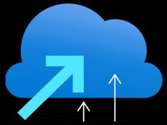

  

<h1 align="center">
  Migrate and Modernise Scale Accelerator
   
</h1>

<h4 align="center">Focused on the success of small and mid-market customers in Australia & NZ, we’d like to introduce you to a new program designed to accelerate your business helping customers adopt Microsoft Azure!</a>.</h4>

  <a href="#key-differentiators">Key Differentiators</a> •
  <a href="#website">Website</a> •
  <a href="#contact">Contact</a>

## Key Differentiators ##

- Small and Mid-Market partner focus
- All live content presented at ANZ friendly times & recorded
- Delivered by local Microsoft ANZ experts
- Holistic coverage of the entire opportunity lifecycle
- Take away assets, not just guidance

The MMSA will deliver resources across deep-dive webinars, sales kits and delivery blueprints to enable your organization to succeed with migrating and modernizing customer workloads to Azure.

## Website ##

Please access our webpages at [aka.ms/mmsa](https://aka.ms/mmsa) for the latest information on the program.

## Contact

> LinkedIn [Michael Friedrich](https://www.linkedin.com/in/1michaelfriedrich/) &nbsp;&middot;&nbsp;
> GitHub [fredderf204](https://github.com/fredderf204) &nbsp;&middot;&nbsp;
> Twitter [@fredderf204](https://twitter.com/fredderf204)