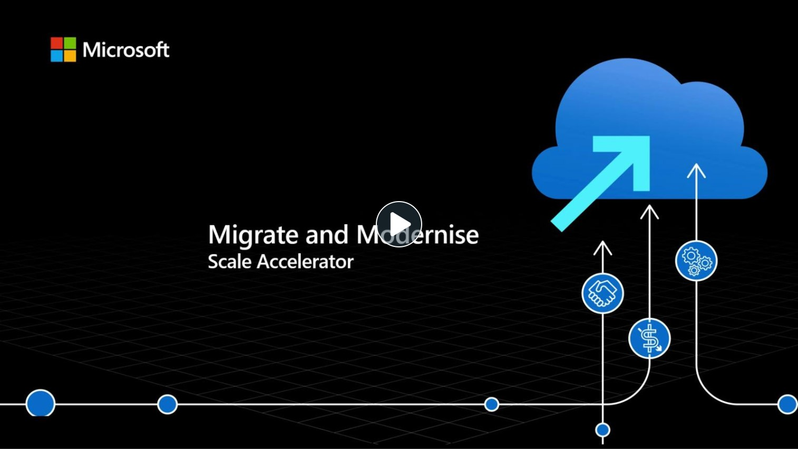

As a Microsoft partner focused on the success of small and mid-market customers in Australia & NZ, we’d like to introduce you to a new program designed to accelerate your business helping customers adopt Microsoft Azure!

#### Key Differentiators ####

- Small and Mid-Market partner focus
- All live content presented at ANZ friendly times & recorded
- Delivered by local Microsoft ANZ experts
- Holistic coverage of the entire opportunity lifecycle
- Take away assets, not just guidance

The MMSA will deliver resources across deep-dive webinars, sales kits and delivery blueprints to enable your organization to succeed with migrating and modernizing customer workloads to Azure.

Watch the following video for more detail, share this invitation across your organization and sign up for our initial set of events below.

#### Upcoming Events ####

##### Secrets of the Sale: How to Effectively Sell Microsoft Azure #####

Join us as we unpack everything you need to know about selling the value of Microsoft Azure. Coverage includes the Microsoft Customer Engagement Methodology, deal orchestration, funding and more!

24 November 2023 - 10am AEDT / 12pm NZDT

[Register Now](https://msit.events.teams.microsoft.com/event/fee77f31-22d4-4d21-b820-ba7b0d7f4215@72f988bf-86f1-41af-91ab-2d7cd011db47)

##### Azure Landing Zones – Part 1 of the Migrate & Modernize series #####

This webinar is the first of a series focused around migrating and modernizing workloads to Azure for Microsoft Partners. This session will enable Microsoft partners on everything to prepare Azure environments with proper guardrails for security, compliance, and governance. We will explore the importance of consistent environmental configuration with Azure landing zones, design considerations required for environmental and compliance readiness, and implementation options to accelerate landing zone deployments and configuration.

29 November 2023 - 12pm AEDT / 2pm NZDT

[Register Now](https://msit.events.teams.microsoft.com/event/7b952467-ee2d-45e9-83c9-c91e6f92f6d5@72f988bf-86f1-41af-91ab-2d7cd011db47)